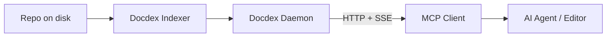

[](https://smithery.ai/server/@bekirdag/docdex)


# Docdex

> **Turn your repository into fast, private context that humans and AI can trust.**

Docdex is a **local-first indexer and search daemon** for documentation and source code. It sits between your raw files and your AI assistant, providing deterministic search, code intelligence, and persistent memory without ever uploading your code to a cloud vector store.

## ⚡ Why Docdex?

Most AI tools rely on "grep" (fast but dumb) or hosted RAG (slow and requires uploads). Docdex runs locally, understands code structure, and gives your AI agents a persistent memory.

| Problem | Typical Approach | The Docdex Solution |
| --- | --- | --- |
| **Finding Context** | `grep`/`rg` (Noisy, literal matches) | **Ranked, structured results** based on intent. |
| **Code Privacy** | Hosted RAG (Requires uploading code) | **Local-only indexing.** Your code stays on your machine. |
| **Siloed Search** | IDE-only search bars | **Shared Daemon** serving CLI, HTTP, and MCP clients simultaneously. |
| **Code Awareness** | String matching | **AST & Impact Graph** to understand dependencies and definitions. |

---

## 🚀 Features

* **📚 Document Indexing:** Rank and summarize repo documentation instantly.
* **🧠 AST & Impact Graph:** Search by function intent and track downstream dependencies (supports Rust, Python, JS/TS, Go, Java, C++, and more).
* **💾 Repo Memory:** Stores project facts, decisions, and notes locally.
* **👤 Agent Memory:** Remembers user preferences (e.g., "Use concise bullet points") across different repositories.
* **🔌 MCP Native:** Auto-configures for tools like Claude Desktop, Cursor, and Windsurf.
* **🌐 Web Enrichment:** Optional web search with local LLM filtering (via Ollama).

---

## 📦 Set-and-Forget Install

Install once, point your agent at Docdex, and it keeps working in the background.

### 1. Install via npm (Recommended)

Requires Node.js >= 18. This will download the correct binary for your OS (macOS, Linux, Windows).

```bash
npm i -g docdex

```

### 2. Auto-Configuration

If you have any of the following clients installed, Docdex automatically configures them to use the local MCP server:

> **Claude Desktop, Cursor, Windsurf, Cline, Roo Code, Continue, VS Code, PearAI, Void, Zed, Codex.**

*Note: Restart your AI client after installation.*

---

## 🛠️ Usage Workflow

### 1. Index a Repository

Run this once to build the index and graph data.

```bash
docdexd index --repo /path/to/my-project

```

### 2. Start the Daemon

Start the shared server. This handles HTTP requests and MCP connections.

```bash
docdexd daemon --repo /path/to/my-project --host 127.0.0.1 --port 3210

```

### 3. Ask Questions (CLI)

You can chat directly from the terminal.

```bash
docdexd chat --repo /path/to/my-project --query "how does auth work?"

```

---

## 🔌 Model Context Protocol (MCP)

Docdex is designed to be the "brain" for your AI agents. It exposes an MCP endpoint that agents connect to.

### Architecture



### Manual Configuration

If you need to configure your client manually:

**JSON (Claude/Cursor/Continue):**

```json
{
  "mcpServers": {
    "docdex": {
      "url": "http://localhost:3210/sse"
    }
  }
}

```

**TOML (Codex):**

```toml
[mcp_servers]
docdex = { url = "http://localhost:3210/v1/mcp" }

```

---

## 🤖 capabilities & Examples

### 1. AST & Impact Analysis

Don't just find the string "addressGenerator"; find the **definition** and what it impacts.

```bash
# Find definition
curl "http://127.0.0.1:3210/v1/ast?name=addressGenerator&pathPrefix=src"

# Track downstream impact (what breaks if I change this?)
curl "http://127.0.0.1:3210/v1/graph/impact?file=src/app.ts&maxDepth=3"

```

### 2. Memory System

Docdex allows you to store "facts" that retrieval helps recall later.

**Repo Memory (Project specific):**

```bash
# Teach the repo a fact
docdexd memory-store --repo . --text "Payments retry up to 3 times with backoff."

# Recall it later
docdexd memory-recall --repo . --query "payments retry policy"

```

**Agent Memory (User preference):**

```bash
# Set a style preference
docdexd profile add --agent-id "default" --category style --content "Use concise bullet points."

```

### 3. Local LLM (Ollama)

Docdex uses Ollama for embeddings and optional local chat.

* **Setup:** Run `docdex setup` for an interactive wizard.
* **Manual:** Ensure `nomic-embed-text` is pulled in Ollama (`ollama pull nomic-embed-text`).
* **Custom URL:**
```bash
DOCDEX_OLLAMA_BASE_URL=http://127.0.0.1:11434 docdexd daemon ...

```


---

## ⚙️ Configuration & HTTP API

Docdex runs as a local daemon serving:

* **CLI Commands:** `docdexd chat`
* **HTTP API:** `/search`, `/v1/ast`, `/v1/graph/impact`
* **MCP Endpoints:** `/v1/mcp` and `/sse`

### Multi-Repo Setup

To support multiple repositories simultaneously, run separate daemons on different ports and add them to your MCP config.

```bash
docdexd daemon --repo /path/to/repo-a --port 3210
docdexd daemon --repo /path/to/repo-b --port 3220

```

### Security

* **Secure Mode:** By default, Docdex enforces TLS on non-loopback binds.
* **Loopback:** `127.0.0.1` is accessible without TLS for local agents.
* To expose to a network (use with caution), use `--expose` and `--auth-token`.

---

## 📚 Learn More

* **Smithery:** [View on Smithery.ai](https://smithery.ai/server/@bekirdag/docdex)
* **Detailed Usage:** `docs/usage.md`
* **API Reference:** `docs/http_api.md`
* **MCP Specs:** `docs/mcp/errors.md`