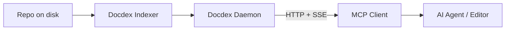

[](https://mcptoplist.com/server/io.github.bekirdag%2Fdocdex)

[](https://docdex.org)


# Docdex

> **Turn your repository into fast, private context that humans and AI can trust.**

Docdex is a **local-first indexer and search daemon** for documentation and source code. It sits between your raw files and your AI assistant, providing deterministic search, code intelligence, and persistent memory without ever uploading your code to a cloud vector store.

## ⚡ Why Docdex?

Most AI tools rely on "grep" (fast but dumb) or hosted RAG (slow and requires uploads). Docdex runs locally, understands code structure, and gives your AI agents a persistent memory.

| Problem | Typical Approach | The Docdex Solution |
| --- | --- | --- |
| **Finding Context** | `grep`/`rg` (Noisy, literal matches) | **Ranked, structured results** based on intent. |
| **Code Privacy** | Hosted RAG (Requires uploading code) | **Local-only indexing.** Your code stays on your machine. |
| **Siloed Search** | IDE-only search bars | **Shared Daemon** serving CLI, HTTP, and MCP clients simultaneously. |
| **Code Awareness** | String matching | **AST & Impact Graph** to understand dependencies and definitions. |

---

## 🚀 Features

* **📚 Document Indexing:** Rank and summarize repo documentation instantly.
* **🧠 AST & Impact Graph:** Search by function intent and track downstream dependencies (supports Rust, Python, JS/TS, Go, Java, C++, and more).
* **💾 Repo Memory:** Stores project facts, decisions, and notes locally.
* **👤 Agent Memory:** Remembers user preferences (e.g., "Use concise bullet points") across different repositories.
* **🗂️ Conversation Memory:** Imports transcripts, keeps wake-up bundles compact, and derives repo-scoped summaries, diary entries, and working memory.
* **🕸️ Temporal Knowledge Graph:** Extracts entities, edges, episodes, and code-facing links from archived conversations for timeline and neighborhood queries.
* **🧭 Wake-Up + Project Map Context:** Injects compact wake-up bundles, profile truth, and cached `Project map:` context into OpenAI-compatible chat completions.
* **🔌 MCP Native:** Auto-configures for tools like Claude Desktop, Cursor, and Windsurf.
* **🌐 Web Enrichment:** Optional web search with local LLM filtering through detected local LLM services.

---

## 📦 Set-and-Forget Install

Install once, point your agent at Docdex, and it keeps working in the background.

### 1. Install via npm (Recommended)

Requires Node.js >= 18. This will download the correct binary for your OS (macOS, Linux, Windows).

```bash
npm i -g docdex

```

> [!WARNING]
> **Windows requirement:** Docdex uses the MSVC runtime. Install the **Microsoft Visual C++ Redistributable 2015-2022 (x64)** before running `docdex`/`docdexd`.
> - Winget: `winget install --id Microsoft.VCRedist.2015+.x64`
> - Manual: download `vc_redist.x64.exe` from Microsoft: https://aka.ms/vs/17/release/vc_redist.x64.exe
> - If `docdexd` exits with `0xC0000135`, the runtime is missing.

### 2. Auto-Configuration

If you have any of the following clients installed, Docdex automatically configures them to use the local MCP endpoint (daemon HTTP/SSE):

> **Claude Desktop, Cursor, Windsurf, Cline, Roo Code, Continue, VS Code, PearAI, Void, Zed, Codex.**

*Note: Restart your AI client after installation.*

---

## 🛠️ Usage Workflow

### 1. Index a Repository

Run this once to build the index and graph data.

```bash
docdexd index --repo /path/to/my-project

```

### 2. Start the Daemon

Start the shared server. This handles HTTP requests and MCP connections.

```bash
docdex start
# or: docdexd daemon --host 127.0.0.1 --port 28491

```

### 3. Ask Questions (CLI)

You can chat directly from the terminal.

```bash
docdexd chat --repo /path/to/my-project --query "how does auth work?"

```

---

## 🔌 Model Context Protocol (MCP)

Docdex is designed to be the "brain" for your AI agents. It exposes an MCP endpoint that agents connect to.

### Architecture



Use the daemon HTTP/SSE endpoint. For sandboxed clients, Docdex can also serve MCP over local IPC
(Unix socket or Windows named pipe), while HTTP/SSE remains the default for most MCP clients.

### Manual Configuration

If you need to configure your client manually:

**JSON (Claude/Cursor/Continue):**

```json
{
  "mcpServers": {
    "docdex": {
      "url": "http://127.0.0.1:28491/v1/mcp/sse"
    }
  }
}

```

**Claude Code (CLI) JSON (`~/.claude.json` or project `.mcp.json`):**

```json
{
  "mcpServers": {
    "docdex": {
      "type": "http",
      "url": "http://127.0.0.1:28491/v1/mcp"
    }
  }
}

```

**TOML (Codex):**

```toml
[mcp_servers.docdex]
url = "http://127.0.0.1:28491/v1/mcp"
tool_timeout_sec = 300
startup_timeout_sec = 300

```

---

## 🤖 capabilities & Examples

### 1. AST & Impact Analysis

Don't just find the string "addressGenerator"; find the **definition** and what it impacts.

```bash
# Find definition
curl "http://127.0.0.1:28491/v1/ast?name=addressGenerator&pathPrefix=src"

# Track downstream impact (what breaks if I change this?)
curl "http://127.0.0.1:28491/v1/graph/impact?file=src/app.ts&maxDepth=3"

```

### 2. Memory System

Docdex allows you to store "facts" that retrieval helps recall later.

**Repo Memory (Project specific):**

```bash
# Teach the repo a fact
docdexd memory-store --repo . --text "Payments retry up to 3 times with backoff."

# Recall it later
docdexd memory-recall --repo . --query "payments retry policy"

```

**Agent Memory (User preference):**

```bash
# Set a style preference
docdexd profile add --agent-id "default" --category style --content "Use concise bullet points."

```

### 3. Conversation Memory

Conversation memory is repo-scoped by default and optional. Repo-less sessions must use an explicit conversation namespace so they never silently reuse a repo archive. The subsystem imports transcripts, stores episodic summaries and working memory, derives diary entries and temporal KG facts into `knowledge.db`, and keeps recall under a strict wake-up budget.

The CLI archive, diary, and hook commands are HTTP-backed wrappers, so start `docdex start` or `docdexd daemon` first.

```bash
# Archive and inspect transcripts
docdexd conversations import --repo . ./session.txt --format plain_text --agent-id codex
docdexd conversations list --repo . --agent-id codex
docdexd conversations search --repo . "timeline_index"
docdexd conversations read --repo . <session_id>

# Import into an explicit global conversation namespace instead of a repo archive
docdexd conversations import --conversation-namespace shared-team ./session.txt --format plain_text --agent-id codex
docdexd conversations search --conversation-namespace shared-team "timeline_index"

# Keep agent diary notes alongside imported sessions
docdexd diary write --repo . --agent-id codex "Wake-up rollout validated against knowledge.db timeline output."
docdexd diary read --repo . --agent-id codex

# Trigger durable summarization from an external transcript
docdexd hook conversation --repo . \
  --action session_close_summarization \
  --source codex \
  --agent-id codex \
  --transcript ./session.txt \
  --format plain_text \
  --wait-for-processing

# Build a compact wake-up bundle over recent context
curl -X POST http://127.0.0.1:28491/v1/wakeup \
  -H "Content-Type: application/json" \
  -d '{"agent_id":"codex","query":"timeline_index","max_tokens":96}'

# Address the same archive over HTTP without repo_id
curl -X POST http://127.0.0.1:28491/v1/wakeup \
  -H "Content-Type: application/json" \
  -H "x-docdex-conversation-namespace: shared-team" \
  -d '{"agent_id":"codex","query":"timeline_index","max_tokens":96}'

# Explore derived repo-scoped knowledge facts and provenance
curl "http://127.0.0.1:28491/v1/kg/query?q=knowledge.db&limit=10"
curl "http://127.0.0.1:28491/v1/kg/search/nodes?q=knowledge&limit=10"
curl "http://127.0.0.1:28491/v1/kg/neighborhood?entity=knowledge.db&limit=10"
curl "http://127.0.0.1:28491/v1/kg/timeline?entity=knowledge.db&limit=10"

# Chat with wake-up + project-map context and inspect reasoning trace metadata
curl -X POST http://127.0.0.1:28491/v1/chat/completions \
  -H "Content-Type: application/json" \
  -d '{
    "model": "fake-model",
    "messages": [{"role": "user", "content": "What changed around knowledge.db?"}],
    "docdex": {
      "agent_id": "codex",
      "limit": 6,
      "include_libs": true,
      "dag_session_id": "session-123"
    }
  }'
```

### 4. Local LLM Services

Docdex detects supported local LLM services before it suggests installing anything. It can reuse Ollama, vLLM, llama.cpp-compatible OpenAI endpoints, LM Studio, LocalAI, SGLang, TGI-compatible deployments, and healthy local mcoda agents when they are already present. Ollama remains the recommended fallback because it is the easiest guided setup path.

* **Setup:** Run `docdex setup` for an interactive wizard that lists detected services, models, embedding candidates, and local delegation agents.
* **Inspect:** Run `docdexd llm detect --json` or `docdexd llm diagnostics --json` to see why a service/model was selected, skipped, or marked unhealthy.
* **Manual Ollama fallback:** If no usable service is installed, pull the fallback embedding model with `ollama pull nomic-embed-text`.
* **Custom Ollama URL:**
```bash
DOCDEX_OLLAMA_BASE_URL=http://127.0.0.1:11434 docdex start --host 127.0.0.1 --port 28491

```


---

## ⚙️ Configuration & HTTP API

Docdex runs as a local daemon serving:

* **CLI Commands:** `docdexd chat`
* **HTTP API:** `/search`, `/v1/capabilities`, `/v1/search/rerank`, `/v1/search/batch`, `/v1/chat/completions`, `/v1/ast`, `/v1/graph/impact`, `/v1/conversations/*`, `/v1/diary/*`, `/v1/hooks/conversation`, `/v1/wakeup`, `/v1/kg/*`
* **MCP Endpoints:** `/v1/mcp` and `/v1/mcp/sse`
* **Capability Negotiation Tools:** `docdex_capabilities`, `docdex_rerank`, `docdex_batch_search`, `docdex_conversation_*`, `docdex_diary_*`, `docdex_conversation_hook`, `docdex_wakeup`, `docdex_kg_*`

### Multi-Repo Setup

Run a single daemon and mount additional repos on demand.

```bash
docdex start --port 28491

# Mount repos and capture repo_id values
curl -X POST "http://127.0.0.1:28491/v1/initialize" \
  -H "Content-Type: application/json" \
  -d '{"rootUri":"file:///path/to/repo-a"}'

curl -X POST "http://127.0.0.1:28491/v1/initialize" \
  -H "Content-Type: application/json" \
  -d '{"rootUri":"file:///path/to/repo-b"}'
```

Notes:
- When more than one repo is mounted (or the daemon starts without a default repo), include `x-docdex-repo-id: <sha256>` on HTTP requests.
- MCP sessions bind to the repo provided in `initialize.rootUri` and reuse that repo automatically.

### Security

* **Secure Mode:** By default, Docdex enforces TLS on non-loopback binds.
* **Loopback:** `127.0.0.1` is accessible without TLS for local agents.
* To expose to a network (use with caution), use `--expose` and `--auth-token`.

---

## 📚 Learn More

* **Detailed Usage:** `docs/usage.md`
* **API Reference:** `docs/http_api.md`
* **MCP Specs:** `docs/mcp/errors.md`


<a href="https://glama.ai/mcp/servers/@bekirdag/docdex">
  
</a>
