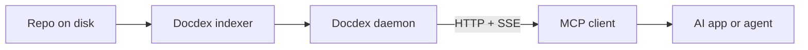

# Docdex

[](https://smithery.ai/server/@bekirdag/docdex)


Docdex is a local-first indexer and search daemon for docs and source code. It turns a repo into fast, private context that humans and AI can trust.

## What Docdex does
1. Document indexing: rank and summarize repo docs fast.
2. Code indexing: search code by intent, not just string match.
3. AST + impact graph: reason about structure and dependencies.
4. Web search + local LLM: optional web enrichment with Ollama-powered filtering.
5. Repo memory: project facts and decisions stored locally.
6. Agent memory: long-lived preferences that follow an agent across repos.

## Set-and-forget install
Install once, point your agent at Docdex, and it keeps working in the background.

```bash
npm i -g docdex
```

Auto-configured MCP clients (when config files exist): Claude Desktop, Cursor, Windsurf, Cline, Roo Code, Continue, VS Code, PearAI, Void, Zed, Codex. Restart clients after install.

Index once per repo:
```bash
docdexd index --repo /path/to/repo
```

Start the shared daemon (HTTP + MCP):
```bash
docdexd daemon --repo /path/to/repo --host 127.0.0.1 --port 3210 --log warn --secure-mode=false
```

Ask from the CLI:
```bash
docdexd chat --repo /path/to/repo --query "how does auth work?"
```

## Fast examples

### Document + code search
```bash
docdexd chat --repo /path/to/repo --query "payment retry logic" --limit 5
```

```bash
curl "http://127.0.0.1:3210/search?q=payment%20retry&limit=5"
```

### AST + impact graph
Find a function definition by name:
```bash
curl "http://127.0.0.1:3210/v1/ast?name=addressGenerator&pathPrefix=src"
```

Track downstream impact:
```bash
curl "http://127.0.0.1:3210/v1/graph/impact?file=src/app.ts&maxDepth=3"
```

### Web search + Ollama filtering (optional)
```bash
DOCDEX_WEB_ENABLED=1 docdexd web-search --query "smithery local testing" --limit 5
```

### Memory (repo + agent)
```bash
docdexd memory-store --repo /path/to/repo --text "Payments retry up to 3 times with backoff."
docdexd memory-recall --repo /path/to/repo --query "payments retry policy" --top-k 5
```

```bash
docdexd profile add --agent-id "default" --category style --content "Use concise bullet points."
docdexd profile search --agent-id "default" --query "style" --top-k 5
```

## Why it matters
Docdex is the layer between raw files and an AI assistant. It avoids uploads, keeps context local, and makes search deterministic.

| Problem | Typical approach | What Docdex changes |
| --- | --- | --- |
| Find relevant context | `grep`/`rg` (fast, literal, noisy) | Ranked, structured results that match intent |
| AI needs repo context | Hosted RAG (upload code) | Local-only indexing, no upload required |
| Search is siloed | IDE-only search | Shared daemon for CLI, HTTP, and MCP clients |

## Daemon, MCP, HTTP, security
Docdex runs as a local daemon and serves:
- CLI commands (`docdexd chat`, `docdexd query`)
- HTTP APIs (`/search`, `/v1/ast`, `/v1/graph/impact`)
- MCP endpoints for agents (`/v1/mcp` and `/sse`)

Security and TLS:
- Secure-mode defaults enforce TLS on non-loopback binds.
- Provide certs with `--tls-cert/--tls-key` or use `--insecure` behind a trusted proxy.

MCP config examples:
```json
{
  "mcpServers": {
    "docdex": {
      "url": "http://localhost:3210/sse"
    }
  }
}
```

```toml
[mcp_servers]
docdex = { url = "http://localhost:3210/v1/mcp" }
```

## Supported AST languages
Rust, Python, JavaScript, TypeScript, Go, Java, C#, C/C++, PHP, Kotlin, Swift, Ruby, Lua, Dart.

## Auto-detected MCP clients
Claude Desktop, Cursor, Windsurf, Cline, Roo Code, Continue, VS Code, PearAI, Void, Zed, Codex.

## Local LLM + embeddings (Ollama)
Docdex uses Ollama for embeddings and optional local chat.

First-time setup (recommended):
```bash
docdex setup
```

Manual setup:
```bash
ollama serve
ollama pull nomic-embed-text
```

Point Docdex at Ollama if needed:
```bash
DOCDEX_OLLAMA_BASE_URL=http://127.0.0.1:11434 docdexd daemon --repo /path/to/repo --host 127.0.0.1 --port 3210
```

## Multi-repo setup
Run separate daemons for different repositories and connect both to your MCP client.

```bash
docdexd daemon --repo /path/to/repo-a --host 127.0.0.1 --port 3210 --log warn --secure-mode=false
docdexd daemon --repo /path/to/repo-b --host 127.0.0.1 --port 3220 --log warn --secure-mode=false
```

```json
{
  "mcpServers": {
    "docdex-repo-a": { "url": "http://localhost:3210/sse" },
    "docdex-repo-b": { "url": "http://localhost:3220/sse" }
  }
}
```

## Daemon + MCP flow

SSE endpoint: `/sse`

## Learn more
- Detailed usage guide: `docs/usage.md`
- HTTP API reference: `docs/http_api.md`
- MCP errors and contracts: `docs/mcp/errors.md`
